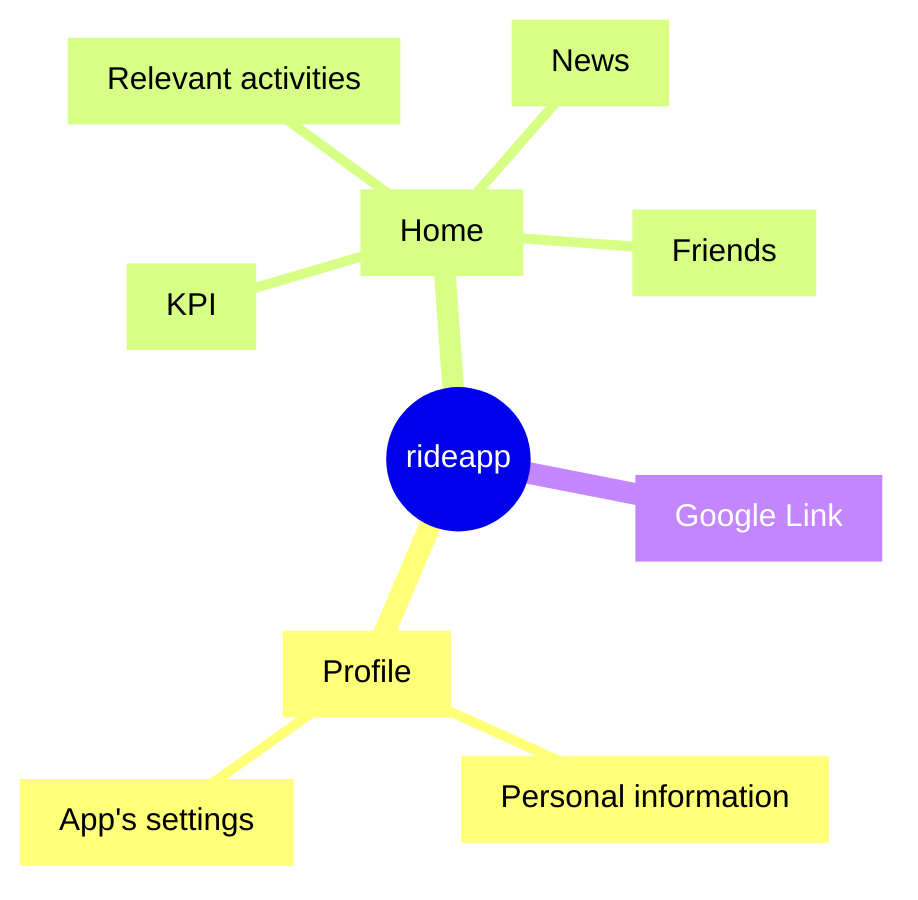
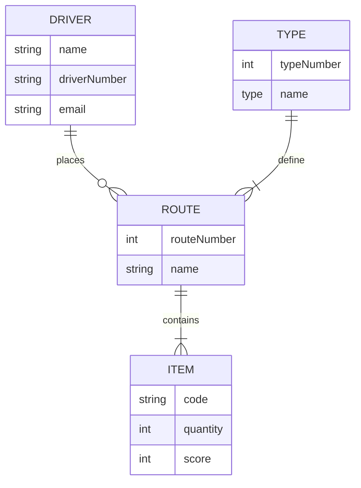

# rideapp

## Getting Started

```mermaid
mindmap
  root((rideapp))
    A[Profile]
      A1[Personal information]
      A2[App's settings]
    B[Home]
      B1[KPI]
      B2[Relevant activities]
      B3[News]
      B4[Friends]
    C[Google Link]
```

**Note:** Click [Google Link](https://www.google.com) to visit Google.

## Diagrama de Entidad Relación 

```mermaid
erDiagram
    DRIVER ||--o{ ROUTE : places
    DRIVER {
        string name
        string driverNumber
        string email
    }
    ROUTE ||--|{ ITEM : contains
    ROUTE {
        int routeNumber
        string name
    }
    ITEM {
        string code 
        int quantity
        int score
    }
    TYPE ||--|{ ROUTE : define
    TYPE {
        int typeNumber
        type name
    }
```
